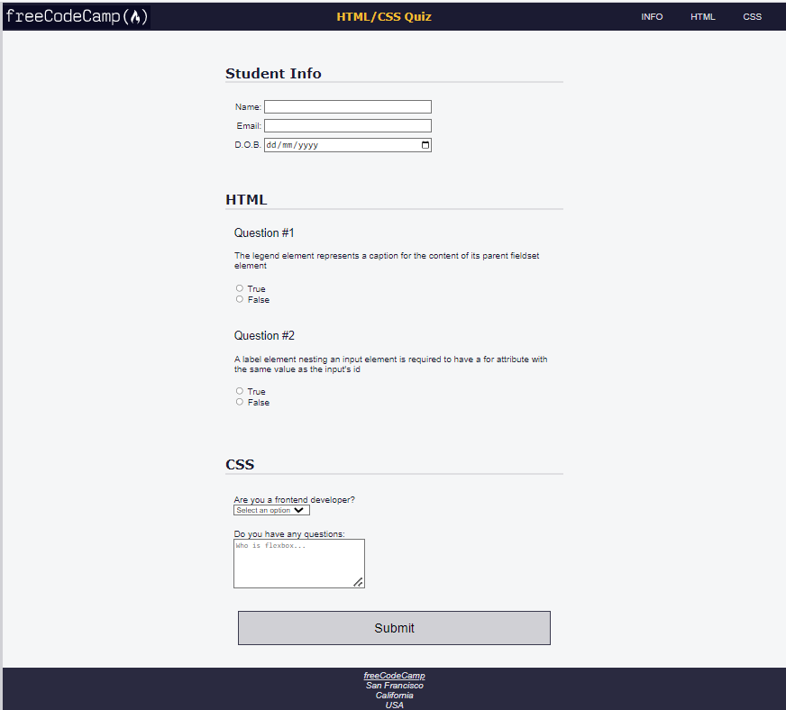

# Learn Accessibility by Building a Quiz

The task list link is [FreeCampCode a Quiz](https://www.freecodecamp.org/learn/2022/responsive-web-design/learn-accessibility-by-building-a-quiz/step-1)

The task screen shot;

